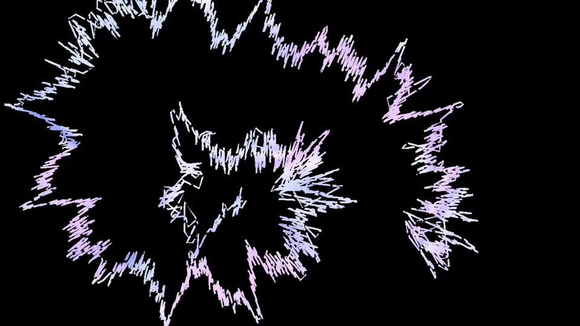

# 波形ライン

AviUtl ExEdit2 用のカスタムオブジェクトです。
プレビュー上でマウスを使って線を描き、その線を音声の波形に合わせて揺らします。
外部ツールは要りません。AviUtl2 の中だけで完結します。

## 導入

`波形ライン.obj2` を `C:\ProgramData\aviutl2\Script\` （またはその中のフォルダ）に置き、AviUtl2 を起動します。
初回は「スクリプト・プラグインの追加」の確認が出るので許可してください。

カスタムオブジェクトの一覧に「波形ライン」が追加されます。

## 使い方

1. タイムラインに「波形ライン」を置きます。プレビューに赤い十字と四角い枠（ペン先）が出ます。
2. **モード**を「描く」にして、枠の中を掴んでドラッグすると線が描かれます。
3. 別の場所から描きたいときは、一度「描かない」にしてペン先を移動し、また「描く」に戻します。
   「描く」に戻したところから新しいひと筆になり、前の線とはつながりません。
4. 描き終わったら**モード**を「波形にする」にします。同じフレームで鳴っている音に合わせて線が揺れます。

音が鳴っていないときは揺れません（手描きのブレも止まります）。

描いた線はプロジェクトに保存されるので、AviUtl2 を閉じて開き直しても残ります
（保存できる点の数は 1 オブジェクトあたり約 4000 点です）。

ペン先の十字と枠は編集画面にだけ表示され、出力には含まれません。

## 設定

| 項目 | 内容 |
|---|---|
| モード | 描く / 描かない / 波形にする |
| 操作 | 選んだ瞬間に 1 回だけ効きます。1つ戻す / 戻すを戻す / 全部消す / 輪にする。使ったら「なし」に戻してください |
| 太さ | 線の太さ |
| 色 / 色2(グラデ) | 色2 を指定すると線の始まりから終わりへグラデーションします |
| 波形をならす | 波形の細かい振動をならします。0 でそのまま |
| 描く割合 | 線を始点から何 % まで表示するか。動かすと線が伸びていく演出になります |
| 破線の長さ / 破線のすき間 | 両方を 0 より大きくすると破線になります |
| 波形の振幅 | 揺れの大きさ |
| 波の回数 | 線 1 本に波形を何回ぶん並べるか |
| 波形の形 | なめらか / 四角（等間隔の鋭い尖りで、高さが音に合わせて変わる） |
| 手描きのブレ | 線全体をゆるくうねらせます。数フレームごとにカクッと変わります |
| 座標 | 描いた線の保存先です。触らないでください |

## 注意

- 「描く」モードのままオブジェクトを動かすと、その動きがすべて線になります。
- 描いている間は、線が歪み直さないよう波形もブレもかかりません。
- 拡大率を変えると、線の中心を軸に線だけが拡大されます（ペン先の大きさは変わりません）。

## ライセンス

MIT License
